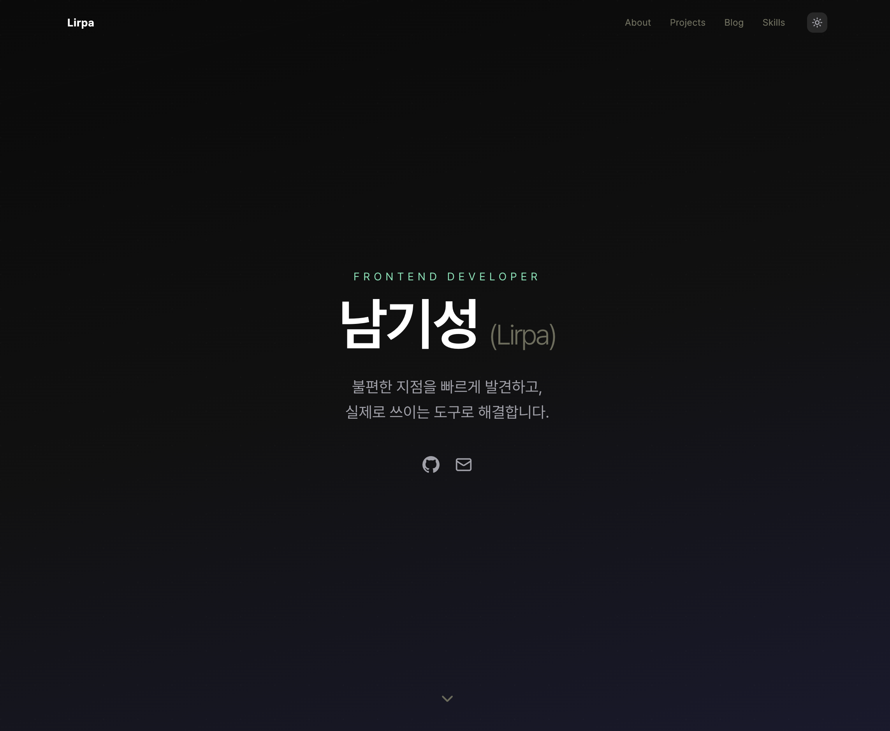
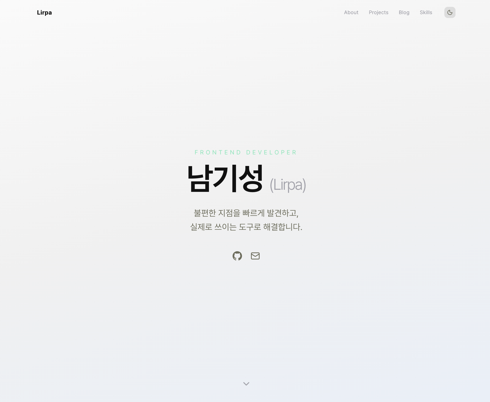

# Lirpa 포트폴리오

개인 포트폴리오 웹사이트입니다.

**Live:** [lirpa62-portfolio.vercel.app](https://lirpa62-portfolio.vercel.app/)

| Dark Mode                                       | Light Mode                                        |
| ----------------------------------------------- | ------------------------------------------------- |
|  |  |

## 기술 스택

- **Framework:** Next.js (App Router)
- **Language:** TypeScript
- **Styling:** Tailwind CSS
- **Blog:** MDX + next-mdx-remote + rehype-pretty-code
- **Animation:** IntersectionObserver 기반 스크롤 진입 애니메이션
- **Deploy:** Vercel

## 구조

```
src/
├── app/
│   ├── layout.tsx, page.tsx, globals.css, providers.tsx
│   ├── blog/page.tsx
│   ├── blog/[slug]/page.tsx
│   └── projects/[id]/page.tsx
├── components/
│   ├── Nav.tsx, Hero.tsx, About.tsx
│   ├── Projects.tsx, ProjectCard.tsx, ProjectDetail.tsx
│   ├── Skills.tsx, Contact.tsx, FadeIn.tsx
│   ├── BlogCard.tsx, BlogSection.tsx, MdxContent.tsx
│   └── icons/GithubIcon.tsx
├── context/theme-context.tsx
├── data/resume.ts
├── hooks/useColors.ts
├── lib/posts.ts
└── types/project.ts

posts/           # MDX 블로그 파일
public/images/   # 프로젝트 스크린샷
```

## 로컬 실행

```bash
git clone https://github.com/lirpa62/Portfolio.git
cd Portfolio
npm install
npm run dev
```

`http://localhost:3000`에서 확인할 수 있습니다.

## 라이선스

이 프로젝트는 **MIT License**를 따릅니다. 자세한 내용은 [LICENSE](LICENSE) 파일을 확인해 주세요.

---

_Copyright (c) 2026 Lirpa_
